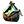

<table style="border: 0px;margin: 0 0;">
  <tr>
    
    

     
    &emsp;
    &emsp;
    &emsp;
    &emsp;
    &emsp;
    &emsp;
    &emsp;
    &emsp;
    
    

     
    我是郑天佐，目前专注于远程桌面的开发，主要使用C++，喜欢研究高性能与代码架构。
     
    I am zhengtianzuo, currently focusing on remote desktop development, primarily using C++. I enjoy researching high performance and code architecture.
     
    <table>
      <tr>愿景: 技术分享，共创辉煌</tr> 
      <tr>使命: 创造价值，成就客户，服务行业</tr> 
      <tr>价值观: 挖掘功能，集大成者，精准服务</tr> 
      <tr>Vision: Technology Sharing, Creating Brilliance Together</tr> 
      <tr>Mission: Creating Value, Empowering Clients, Serving the Industry</tr> 
      <tr>Values: Exploring Functionality, Integrating Excellence, Delivering Precision</tr>
    </table>
    个人产品：(Personal Projects:)
    <table style="border-collapse: collapse; border: 1px solid #f47523; border-radius: 10px;margin: 0 0;">
      <thead align="center">
        <tr>
          <th>Logo</th>
          <th>产品(Project)</th>
          <th>Github</th>
          <th>Gitee</th>
          <th>简述(Description)</th>
          <th>技术(Technologies)</th>
        </tr>
      </thead>
      <tbody align="left">
        <tr>
          <th>
            
          </th>
          <th>
            天佐.盘古斧 tianzuo.Pangu
          </th>
          <th>
            
          </th>
          <th>
            
          </th>
          <th>
            即时通讯平台 Instant Messaging Platform
          </th>
          <th>
                    
          </th>
        </tr>
        <tr>
          <th>
            
          </th>
          <th>
            天佐.昆仑镜 tianzuo.Kunlun
          </th>
          <th>
            
          </th>
          <th>
            
          </th>
          <th>
            本地构建工具 Local Build Tool
          </th>
          <th>
                  
          </th>
        </tr>
        <tr>
          <th>
            
          </th>
          <th>
            天佐.伏羲琴 tianzuo.Fuxi
          </th>
          <th>
            
          </th>
          <th>
            
          </th>
          <th>
            开发中 In development
          </th>
          <th>
                
          </th>
        </tr>
      </tbody>
    </table>
  </tr>

  <tr>
  个人模块：(Personal Modules:)
  <table style="border-collapse: collapse; border: 1px solid #f47523; border-radius: 10px;margin: 0 0;">
    <thead align="center">
      <tr>
        <th>Logo</th>
        <th>模块(Modules)</th>
        <th>Github</th>
        <th>Gitee</th>
          <th>简述(Description)</th>
          <th>技术(Technologies)</th>
      </tr>
    </thead>
      <tbody align="left">
        <tr>
          <th>
            
          </th>
          <th>
            天佐.崆峒印 tianzuo.Kongtong
          </th>
          <th>
            
          </th>
          <th>
            
          </th>
          <th>
            崩溃检测分析 Crash Detection & Analysis
          </th>
          <th>
             
          </th>
        </tr>
        <tr>
          <th>
            
          </th>
          <th>
            天佐.乾坤袋 tianzuo.Qiankun
          </th>
          <th>
            
          </th>
          <th>
            
          </th>
          <th>
            NoSql数据库 NoSQL Database
          </th>
          <th>
             
          </th>
        </tr>
        <tr>
          <th>
            
          </th>
          <th>
            天佐.追日靴 tianzuo.Zhuiri
          </th>
          <th>
            
          </th>
          <th>
            
          </th>
          <th>
            UDP可靠数据传输 Reliable UDP Data Transfer
          </th>
          <th>
             
          </th>
        </tr>
        <tr>
          <th>
            
          </th>
          <th>
            天佐.混沌钟 tianzuo.Hundun
          </th>
          <th>
            
          </th>
          <th>
            
          </th>
          <th>
            软件许可授权 Software Licensing
          </th>
          <th>
             
          </th>
        </tr>
        <tr>
          <th>
            
          </th>
          <th>
            天佐.炼妖壶 tianzuo.LianYao
          </th>
          <th>
            
            </th>
          <th>
            
          </th>
          <th>
            内存池 Memory Pool
          </th>
          <th>
             
          </th>
        </tr>
        <tr>
          <th>
            
          </th>
          <th>
            天佐.神农鼎 tianzuo.Shennong
          </th>
          <th>
            
            </th>
          <th>
            
          </th>
          <th>
            开发中 In development
          </th>
          <th>
               
          </th>
        </tr>
        <tr>
          <th>
            
          </th>
          <th>
            天佐.玲珑塔 tianzuo.Linglong
          </th>
          <th>
            
            </th>
          <th>
            
          </th>
          <th>
            开发中 In development
          </th>
          <th>
               
          </th>
        </tr>
        <tr>
          <th>
            
          </th>
          <th>
            天佐.封天印 tianzuo.Fengtian
          </th>
          <th>
            
            </th>
          <th>
            
          </th>
          <th>
            开发中 In development
          </th>
          <th>
               
          </th>
        </tr>
      </tbody>
    </table>
  </tr>
</table>

<tr>
<table style="border: 0px;margin: 0 0;">
    <th align="center" style="text-align: center;">
          
     
    加QQ好友 Add QQ Friend
    </th>
    <th align="center" style="text-align: center;">
          
     
    加微信好友 Add WeChat Friend
    </th>
    <th align="center" style="text-align: center;">
     
    关注微信公众号 WeChat Official Account
    </th>
    <th align="center" style="text-align: center;">
          
     
    支付宝赞助 AliPay sponsor
    </th>
    <th align="center" style="text-align: center;">
          
     
    微信赞助 WeChat sponsor
    </th>
</table>
</tr>
